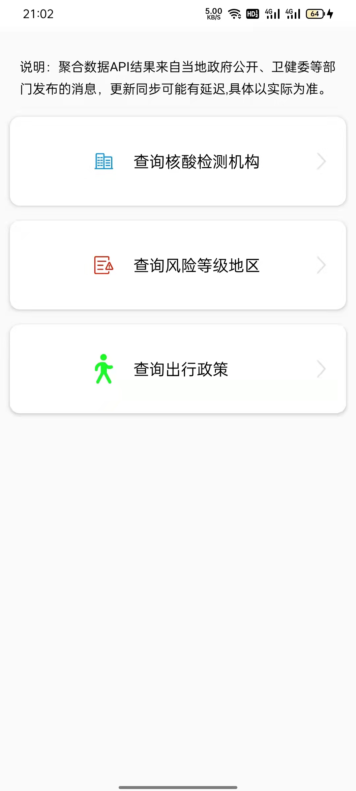
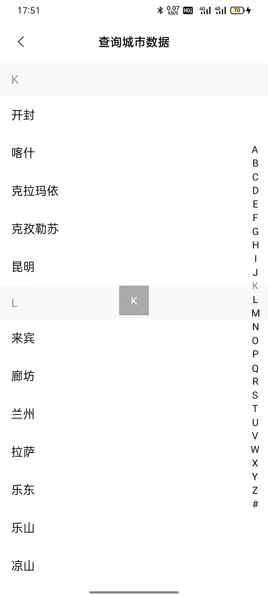
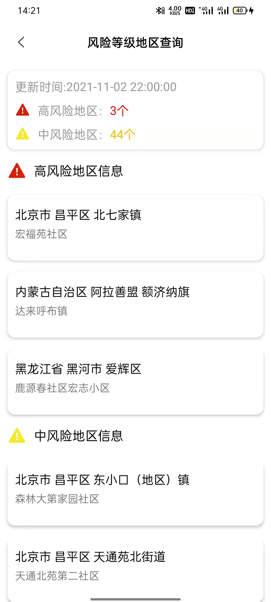
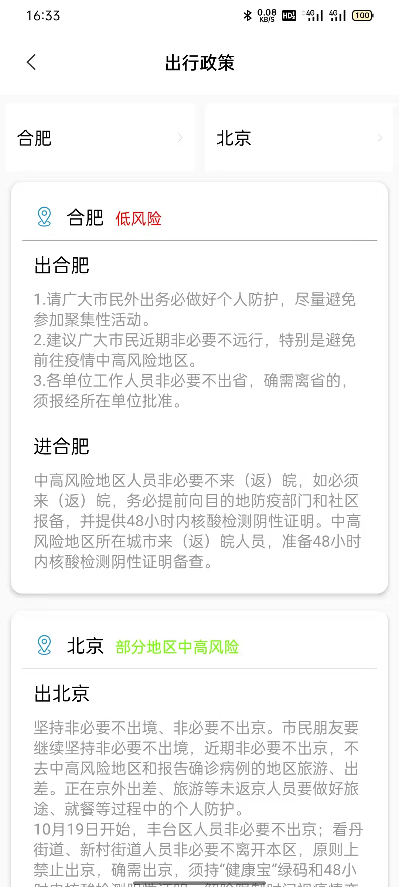

# MVVM开源项目——出行防疫App
## [Compose版本已发布](https://github.com/huanglinqing123/TravelPreventionCompose)

出行防疫App是一款MVVM模式的App，采用了组件化、Aroute、协程、flow等技术，适合初学者学习使用。<br>
此项目将长期维护，后续所有的新技术、平台适配等都将基于此项目实践，且会开发Jetpack Compose版本。<br>
项目数据基于 "聚合数据"在线API，需申请对应的API，申请成功后将key值替换到appbase下BaseApi中的KEY变量中<br>

### 模块说明
- app 入口模块<br>
- appbase 基础模块：基类Activity、网络请求、工具类、配置文件等<br>
- module_city 选择城市模块，所有业务模块依赖，实际开发中也可置于appbase模块中<br>
- module_risk_level 风险等级模块：查询风险等级地区<br>
- module_test_agency 检测机构模块：查询城市核酸检测机构信息<br>
- module_travel_policy 出行政策模块：查询两地间的出行政策<br>









## 注意
- 单独运行module_risk_level、module_test_agency与module_travel_policy模块时，需要依赖module_city模块才可以完整运行，此项目中仅定义了isModule一个变量，若需组件完整运行可定义多个变量，module_risk_level为applciation的时候将module_city设置为library即可。<br>

- 请务必自行申请API接口并将KEY填入，否则程序将抛出异常等问题，若你由于若干种原因无法成功申请，可关注我微信公众号 “Android技术圈”，回复 “key”关键字获取可测试的key。<br>

<br>

  - 公共KEY，接口每天仅可使用50次，请酌情使用


# License

```
/*
* Copyright (C)  HuangLinqing-, TravelPrevention Open Source Project
*
* Licensed under the Apache License, Version 2.0 (the "License");
* you may not use this file except in compliance with the License.
* You may obtain a copy of the License at
*
*      http://www.apache.org/licenses/LICENSE-2.0
*
* Unless required by applicable law or agreed to in writing, software
* distributed under the License is distributed on an "AS IS" BASIS,
* WITHOUT WARRANTIES OR CONDITIONS OF ANY KIND, either express or implied.
* See the License for the specific language governing permissions and
* limitations under the License.
  */
```
